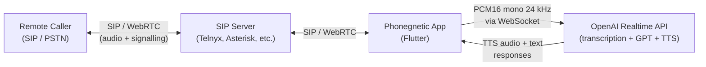

<p align="center">
  
</p>

<h1 align="center">Phonegnetic AI</h1>

<p align="center">
  A retro-future SIP softphone with a built-in AI voice agent that joins your calls.
</p>

<p align="center">
  <a href="https://pub.dev/packages/sip_ua"></a>
  <a href="https://opencollective.com/flutter-webrtc"></a>
  <a href="https://join.slack.com/t/flutterwebrtc/shared_invite/zt-q83o7y1s-FExGLWEvtkPKM8ku_F8cEQ"></a>
</p>

---

## What is Phonegnetic?

Phonegnetic is a Flutter SIP softphone built on the [`sip_ua`](https://pub.dev/packages/sip_ua) library (a Dart port of [JsSIP](https://github.com/versatica/JsSIP)). What makes it different is a real-time AI voice agent that participates in your calls as a third party.

The app captures **both sides** of a live SIP/WebRTC call -- your microphone and the remote caller's audio -- taps the raw PCM stream, and pipes it to the **OpenAI Realtime API**. The AI listens, understands context, and speaks back into the call with sub-second latency. Think of it as giving every phone call an AI copilot.

### Use cases

- **3-way AI call participant** -- trivia host, interview coach, meeting facilitator
- **Real-time transcription and note-taking** -- the agent transcribes both sides of the conversation live
- **Call quality monitoring and compliance** -- flag keywords, enforce scripts, score calls automatically
- **AI receptionist / IVR replacement** -- handle inbound calls with natural conversation instead of "press 1"
- **Accessibility** -- live captioning for deaf or hard-of-hearing callers

## Architecture



**How the audio pipeline works:**

1. A SIP/WebRTC call is established through any standard SIP server.
2. A native audio tap on the device captures PCM from both the microphone (host) and the remote WebRTC stream (caller).
3. The mixed PCM16 mono 24 kHz audio is streamed over a WebSocket to the OpenAI Realtime API.
4. OpenAI transcribes the speech (`gpt-4o-mini-transcribe`), generates a response (GPT), and returns TTS audio.
5. The TTS audio is played back into the call so both the host and the remote caller hear the agent.
6. Transcripts and agent messages appear in a side-panel chat UI in real time.

## Getting started

### Prerequisites

- [Flutter SDK](https://docs.flutter.dev/get-started/install) (stable channel)
- A **SIP account** with WebSocket (WSS) transport ([see below](#sip-credentials))
- An **OpenAI API key** with Realtime API access ([see below](#ai-voice-agent-setup))

### Run the app

```bash
git clone https://github.com/user/dart-sip-ua.git
cd dart-sip-ua/phonegnetic
flutter pub get
flutter run            # or: flutter run -d macos | chrome | windows | linux
```

On first launch the app will attempt to auto-register using the credentials in [`phonegnetic/lib/src/test_credentials.dart`](phonegnetic/lib/src/test_credentials.dart). To use your own account, either edit that file or configure credentials at runtime through **Settings** (the gear icon in the top bar).

## SIP credentials

A SIP account is required to make and receive calls. You need a provider that supports **WebSocket (WSS) transport** for use with WebRTC.

### What you need

| Field | Example |
|-------|---------|
| **WebSocket URL** | `wss://sip.telnyx.com:7443` |
| **SIP URI** | `youruser@sip.telnyx.com` |
| **Auth User** | `youruser` |
| **Password** | `your-password` |

### Where to get SIP credentials

If you do not already have a SIP provider, credentials can be purchased from [**Telnyx**](https://telnyx.com/) -- they provide SIP trunking with full WebSocket/WebRTC support, global coverage, and sub-500ms latency.

Other compatible SIP servers and providers:

- [Asterisk](https://github.com/flutter-webrtc/dockers/tree/main/asterisk) (self-hosted, free)
- FreeSWITCH (self-hosted, free)
- OpenSIPS / Kamailio (self-hosted, free)
- 3CX (commercial PBX with WSS support)
- [tryit.jssip.net](https://tryit.jssip.net) (free public demo for testing)

### Option A: Edit `test_credentials.dart` (auto-register on launch)

Open [`phonegnetic/lib/src/test_credentials.dart`](phonegnetic/lib/src/test_credentials.dart) and replace the placeholder values:

```dart
static String telnyxUsername = 'YOUR_SIP_USERNAME';
static String telnyxPassword = 'YOUR_SIP_PASSWORD';
```

Then point `sipUser` to your provider getter:

```dart
static SipUser get sipUser => _telnyx;
```

### Option B: Configure at runtime

Tap the **menu icon** (top-right) and select **Settings**. The **Phone** tab lets you enter all SIP fields and register on the fly. Values are persisted with `SharedPreferences`.

## AI voice agent setup

The AI agent uses the **OpenAI Realtime API** to listen, think, and speak during live calls.

### Requirements

- An **OpenAI API key** with access to the Realtime API
- A supported model: `gpt-4o-mini-realtime-preview` or `gpt-4o-realtime-preview`

### Configuration

1. Open the app and go to **Settings > Agents** tab.
2. Toggle **Voice Agent** on.
3. Paste your **OpenAI API key**.
4. Pick a **model** and **voice**.
5. Optionally write custom **instructions** to control the agent's personality and behavior.

### Available voices

`coral` (default), `alloy`, `ash`, `ballad`, `echo`, `sage`, `shimmer`, `verse`, `marin`, `cedar`

### Custom instructions

The instructions field accepts freeform text that becomes the agent's system prompt. By default the agent boots as a trivia host, but you can replace this with any persona:

> *"You are a medical intake assistant. Greet the caller, collect their name, date of birth, and reason for visit. Be concise and empathetic."*

The agent automatically identifies speakers as **Host** (mic audio) and **Remote Party** (call audio) and will ask for names if not provided.

### Listen To

The **Listen To** setting controls whose audio the agent transcribes:

| Setting | Behavior |
|---------|----------|
| **Both Sides** | Agent hears host + remote caller (default) |
| **Local Only** | Agent hears only the host's microphone |
| **Remote Only** | Agent hears only the remote caller |

## Agent boot context

When the agent joins a call it needs to know **who it is**, **who else is on the call**, **what its job is**, and **what rules to follow**. This is managed by `AgentBootContext` in [`phonegnetic/lib/src/models/agent_context.dart`](phonegnetic/lib/src/models/agent_context.dart).

### How it works

On startup, `AgentService` creates a boot context and converts it to a structured system prompt via `toInstructions()`. If the user has written custom instructions in Settings > Agents, those override the boot context entirely. Otherwise the boot context generates the prompt automatically from its four fields:

```
AgentBootContext
├── role            →  "## Identity" block (who the agent is)
├── speakers[]      →  "## Speakers" block (who is on the call)
├── jobFunction     →  "## Job Function" block (what to do)
└── guardrails[]    →  "## Guardrails" block (behavioral constraints)
```

The generated prompt also includes a fixed **Rules** section that teaches the agent how to interpret speaker labels (`[Host]:` vs `[Remote Party 1]:`) and to ask for names.

### Default boot context

Out of the box the app ships with `AgentBootContext.trivia()`, a 3-party trivia host:

```dart
AgentBootContext(
  role: 'You are a voice AI agent participating in a 3-party phone call.',
  jobFunction: 'Host a 3-party trivia game with 3 easy questions. Keep score. Award the winner.',
  speakers: [
    Speaker(role: 'Host', source: 'mic'),
    Speaker(role: 'Remote Party 1', source: 'remote'),
  ],
  guardrails: [
    'Stay in character as the trivia host.',
    'Keep questions family-friendly and easy.',
    'Announce scores after each question.',
    'Declare a winner after all 3 questions.',
  ],
);
```

### Creating a custom boot context

To change the agent's persona programmatically, create a new `AgentBootContext` and assign it before the agent initializes. For example, a meeting note-taker:

```dart
AgentBootContext(
  role: 'You are an AI meeting assistant on a live phone call.',
  jobFunction: 'Listen to the conversation silently. When asked, provide a summary '
               'of what was discussed. Track action items and who they were assigned to.',
  speakers: [
    Speaker(role: 'Project Manager', source: 'mic'),
    Speaker(role: 'Client', source: 'remote'),
  ],
  guardrails: [
    'Do not interrupt unless directly addressed.',
    'Keep summaries concise -- bullet points, not paragraphs.',
    'Never fabricate details that were not said on the call.',
  ],
);
```

Or a QA compliance monitor:

```dart
AgentBootContext(
  role: 'You are a call quality analyst monitoring a customer support call.',
  jobFunction: 'Score the agent on greeting, empathy, resolution, and closing. '
               'Flag any policy violations in real time.',
  speakers: [
    Speaker(role: 'Support Agent', source: 'mic'),
    Speaker(role: 'Customer', source: 'remote'),
  ],
  guardrails: [
    'Do not speak aloud during the call -- text-only feedback.',
    'Be objective. Cite specific phrases when flagging issues.',
  ],
);
```

### The `Speaker` model

Each speaker on the call is described by:

| Field | Type | Description |
|-------|------|-------------|
| `role` | `String` | A label for this participant (e.g. `"Host"`, `"Customer"`) |
| `source` | `String` | Audio source: `"mic"` for local microphone, `"remote"` for the WebRTC stream |
| `name` | `String` | The speaker's real name (initially empty; the agent or host can set it at runtime) |

The `label` getter returns `name` if set, otherwise falls back to `role`. Transcripts in the chat UI use this label to attribute who said what.

Speaker names can be updated mid-call by the agent (it will ask "May I get your first names?") or programmatically:

```dart
agentService.updateSpeakerName('Host', 'Patrick');
agentService.updateSpeakerName('Remote Party 1', 'Sarah');
```

### Instructions priority

The system resolves the agent's instructions in this order:

1. **Settings > Agents > Instructions** -- if the user has typed custom instructions in the UI, those are used verbatim as the system prompt.
2. **`AgentBootContext.toInstructions()`** -- if the instructions field is empty, the boot context generates a structured prompt from `role`, `speakers`, `jobFunction`, and `guardrails`.

This means you can either give end users a freeform text box (the Settings approach) or wire up structured boot contexts in code for specific workflows.

## Supported platforms

- [x] iOS
- [x] Android
- [x] Web
- [x] macOS
- [x] Windows
- [x] Linux

## Install notes

### Android Proguard

```
-keep class io.flutter.app.** { *; }
-keep class io.flutter.plugin.**  { *; }
-keep class io.flutter.util.**  { *; }
-keep class io.flutter.view.**  { *; }
-keep class io.flutter.**  { *; }
-keep class io.flutter.plugins.**  { *; }

-keep class com.cloudwebrtc.webrtc.** {*;}
-keep class org.webrtc.** {*;}
```

## FAQ

<details>
<summary>Expand</summary>

### Server not configured for DTLS/SRTP

`WEBRTC_SET_REMOTE_DESCRIPTION_ERROR: Failed to set remote offer sdp: Called with SDP without DTLS fingerprint.`

Your server is not sending a DTLS fingerprint inside the SDP. WebRTC requires encryption by default -- all communications are encrypted using DTLS and SRTP. Your PBX must be configured to use DTLS/SRTP when calling sip_ua.

### Why isn't there a UDP connection option?

This package uses WS or TCP for SIP signalling. Once the session is connected, WebRTC transmits media (audio/video) over UDP automatically.

### SIP/2.0 488 Not acceptable here

The codecs on your PBX server don't match what WebRTC offers:

- **opus** (111, 48 kHz, 2ch)
- **G722** (9, 8 kHz, 1ch)
- **PCMU** (0, 8 kHz, 1ch)
- **PCMA** (8, 8 kHz, 1ch)
- **telephone-event** (110, 48 kHz / 8 kHz)
</details>


## License
Phonegnetic AI is released under the [MIT license](LICENSE).
