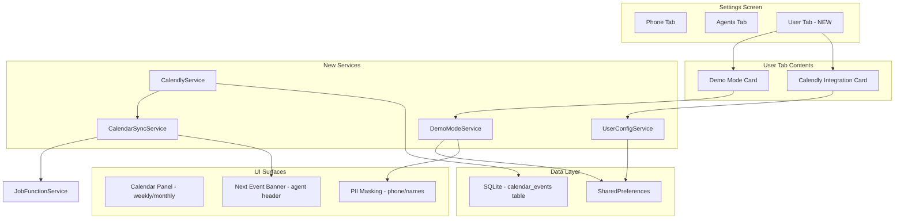

# User Settings, Calendly Calendar, and Demo Mode

## Architecture Overview




## 1. User Settings Tab

**File:** New widget at `[phonegentic/lib/src/widgets/user_settings_tab.dart](phonegentic/lib/src/widgets/user_settings_tab.dart)`

Follows the exact pattern of `[AgentSettingsTab](phonegentic/lib/src/widgets/agent_settings_tab.dart)` - reuses `_AgentCard`-style card containers, `_buildKeyField`, `_buildDropdown`, `Switch.adaptive` patterns, and `ConstrainedBox(maxWidth: 480)` layout.

**Modify** `[register.dart](phonegentic/lib/src/register.dart)`:

- Change `TabController(length: 2, ...)` to `length: 3`
- Add a third tab pill with `Icons.person_rounded` + "User"
- Add `const UserSettingsTab()` to `TabBarView.children`

### Calendly Integration Card

- Section title: "3RD PARTY INTEGRATIONS"
- Expandable dropdown for "Calendly" (future-proof for more integrations)
- When expanded: API Key field (obscured), toggle for "Sync to macOS Calendar", configured/not-set badge
- Settings stored via new `UserConfigService` (SharedPreferences keys: `user_calendly_api_key`, `user_calendly_sync_macos`)

### Demo Mode Card

- Section title: "DEMO MODE"
- Toggle: "Hide PII Data" with subtitle "Mask phone numbers and last names for demo videos"
- When enabled, a text input appears: "Display Number" with placeholder like `(555) 000-0000`
- Settings stored: `user_demo_mode_enabled`, `user_demo_fake_number`

## 2. New Services

### UserConfigService

**File:** `[phonegentic/lib/src/user_config_service.dart](phonegentic/lib/src/user_config_service.dart)`

Static load/save helpers mirroring `[AgentConfigService](phonegentic/lib/src/agent_config_service.dart)` pattern. Config classes:

```dart
class CalendlyConfig {
  final String apiKey;
  final bool syncToMacOS;
  // ...
}

class DemoModeConfig {
  final bool enabled;
  final String fakeNumber;
}
```

### DemoModeService (ChangeNotifier)

**File:** `[phonegentic/lib/src/demo_mode_service.dart](phonegentic/lib/src/demo_mode_service.dart)`

- Registered as a `ChangeNotifierProvider` in `[main.dart](phonegentic/lib/main.dart)`
- Exposes `bool enabled`, `String fakeNumber`, `String maskPhone(String raw)`, `String maskDisplayName(String fullName)`
- `maskPhone`: returns the configured fake number formatted via `PhoneFormatter`
- `maskDisplayName`: returns only the first word (first name) of any display name
- All UI surfaces that display phone numbers or contact names will check this service

**Touch points for PII masking:**

- `[PhoneFormatter.format](phonegentic/lib/src/phone_formatter.dart)` - add a static `demoNumber` override path, or callers check `DemoModeService` before formatting
- `[contact_list_panel.dart](phonegentic/lib/src/widgets/contact_list_panel.dart)` - wrap `display_name` and `phone_number` display
- `[contact_card.dart](phonegentic/lib/src/widgets/contact_card.dart)` - mask fields in read-only display
- `[callscreen.dart](phonegentic/lib/src/callscreen.dart)` - mask `remoteIdentity` / `remoteDisplayName`
- `[agent_panel.dart](phonegentic/lib/src/widgets/agent_panel.dart)` `_CallInfoBar._remoteLabel` - mask the label
- `[dialpad.dart](phonegentic/lib/src/dialpad.dart)` - mask the display name shown on the dialpad

### CalendlyService

**File:** `[phonegentic/lib/src/calendly_service.dart](phonegentic/lib/src/calendly_service.dart)`

- REST client using the `http` package (add to `[pubspec.yaml](phonegentic/pubspec.yaml)`)
- `fetchEvents(DateTime start, DateTime end)` - GET scheduled events from Calendly API
- `createEvent(...)` - POST to create/invite
- Parses Calendly v2 API responses into local `CalendarEvent` model

### CalendarSyncService (ChangeNotifier)

**File:** `[phonegentic/lib/src/calendar_sync_service.dart](phonegentic/lib/src/calendar_sync_service.dart)`

- Registered as provider in `main.dart`, receives `CalendlyService` and `JobFunctionService`
- On init and every 5 minutes: fetches events from Calendly, upserts into SQLite `calendar_events` table
- Tracks `nextEvent` (the soonest upcoming event) and exposes it for the UI banner
- Manages countdown logic: at 60min and 15min before event start, sets `reminderLevel` (`.upcoming` vs `.imminent`)
- At event start time: calls `JobFunctionService.select(event.jobFunctionId)` to auto-switch
- If macOS Calendar sync is enabled, uses the existing `flutter_contacts` or a platform channel (EventKit) to write events - we can defer actual macOS Calendar write to a follow-up and just store the toggle for now

## 3. Database Schema

**Modify** `[call_history_db.dart](phonegentic/lib/src/db/call_history_db.dart)`:

- Bump schema version from `6` to `7`
- New table in `_onUpgrade`:

```sql
CREATE TABLE calendar_events (
  id INTEGER PRIMARY KEY AUTOINCREMENT,
  calendly_event_id TEXT UNIQUE,
  title TEXT NOT NULL,
  description TEXT,
  start_time TEXT NOT NULL,
  end_time TEXT NOT NULL,
  invitee_name TEXT,
  invitee_email TEXT,
  event_type TEXT,
  job_function_id INTEGER REFERENCES job_functions(id),
  location TEXT,
  status TEXT DEFAULT 'active',
  synced_at TEXT,
  created_at TEXT
)
```

- Add CRUD methods: `insertCalendarEvent`, `upsertCalendarEvent`, `getUpcomingEvents`, `getEventsBetween`, `deleteCalendarEvent`

**Model file:** `[phonegentic/lib/src/models/calendar_event.dart](phonegentic/lib/src/models/calendar_event.dart)`

```dart
class CalendarEvent {
  final int? id;
  final String? calendlyEventId;
  final String title;
  final DateTime startTime;
  final DateTime endTime;
  final int? jobFunctionId;
  // ...
  Map<String, dynamic> toMap();
  factory CalendarEvent.fromMap(Map<String, dynamic>);
}
```

## 4. Calendar UI

**File:** `[phonegentic/lib/src/widgets/calendar_panel.dart](phonegentic/lib/src/widgets/calendar_panel.dart)`

A slide-in panel (same pattern as `ContactListPanel` / `CallHistoryPanel`) accessible from the dialpad menu.

### Design

- **Header:** Month/year title with left/right chevrons, "Week" / "Month" toggle chips (same chip style as TCP/WebSocket in register.dart)
- **Weekly view (default):** 7-column grid showing hours 8am-8pm, events as colored time blocks with title. Current time indicated by a thin accent-colored horizontal line.
- **Monthly view:** Traditional month grid, days with event dots. Tapping a day switches to weekly view for that week.
- **Event detail:** Tapping an event shows a minimal bottom sheet with title, time, description, and a dropdown to assign a job function.
- **Styling:** Dark theme consistent with app (`AppColors.surface`, `AppColors.card`, `AppColors.accent` for event blocks, `AppColors.border` for grid lines). Minimal, not busy.

### Navigation

- Add a calendar icon to the dialpad menu (alongside "Settings", etc. in `[dialpad.dart](phonegentic/lib/src/dialpad.dart)`)
- `CalendarSyncService` exposes `isOpen` toggle for the panel visibility (same pattern as `ContactService.isOpen`)

## 5. Next Event Banner in Agent Panel

**Modify** `[agent_panel.dart](phonegentic/lib/src/widgets/agent_panel.dart)`:

Insert a `_CalendarEventBanner` widget between `_AgentHeader` and `_CallInfoBar` in the `Column`:

```
_AgentHeader
_CalendarEventBanner  <-- NEW (only shows when there's an upcoming event within 60min)
_CallInfoBar (if active call)
_MessageList
_InputBar
```

### Banner Design

- **60min prior:** Subtle, single-line, muted appearance:

```
[calendar icon] Next: 9:15 AM - Product Demo with Acme Corp
```

- Uses `AppColors.surface` background, `AppColors.textTertiary` for the prefix, `AppColors.textPrimary` for the event title. Thin bottom border. Height ~36px.
- **15min prior:** Slightly more prominent - accent-tinted background (`AppColors.accent.withOpacity(0.06)`), and the time text uses `AppColors.accent`:

```
[calendar icon] In 12 min - Product Demo with Acme Corp  [job function chip]
```

- The job function chip shows which function will auto-activate (e.g., "Sales Demo" in a small pill). This confirms to the user what's about to happen.
- **At event time:** The banner briefly pulses, then the job function switches. A system message appears in the agent feed: `"Switched to 'Sales Demo' for: Product Demo with Acme Corp"`.
- **After event ends:** Banner fades away, job function reverts to previous (or stays - configurable later).

The banner is deliberately minimal - one line, no extra padding, never blocks or pushes the feed significantly.

## 6. Provider Wiring in main.dart

Add to `[main.dart](phonegentic/lib/main.dart)` provider tree:

```dart
ChangeNotifierProvider<DemoModeService>(create: (_) => DemoModeService()..load()),
ChangeNotifierProxyProvider<JobFunctionService, CalendarSyncService>(
  create: (_) => CalendarSyncService(),
  update: (_, jf, sync) => sync!..jobFunctionService = jf,
),
```

## 7. Dependencies

Add to `[phonegentic/pubspec.yaml](phonegentic/pubspec.yaml)`:

```yaml
http: ^1.2.0
intl: ^0.19.0
```

`http` for Calendly REST calls. `intl` for date/time formatting in the calendar UI (already in root pubspec but needs adding to the app pubspec).

## File Summary


| Action | File                                                                  |
| ------ | --------------------------------------------------------------------- |
| New    | `phonegentic/lib/src/widgets/user_settings_tab.dart`                  |
| New    | `phonegentic/lib/src/user_config_service.dart`                        |
| New    | `phonegentic/lib/src/demo_mode_service.dart`                          |
| New    | `phonegentic/lib/src/calendly_service.dart`                           |
| New    | `phonegentic/lib/src/calendar_sync_service.dart`                      |
| New    | `phonegentic/lib/src/models/calendar_event.dart`                      |
| New    | `phonegentic/lib/src/widgets/calendar_panel.dart`                     |
| Modify | `phonegentic/lib/src/register.dart` (3-tab)                           |
| Modify | `phonegentic/lib/main.dart` (providers)                               |
| Modify | `phonegentic/lib/src/db/call_history_db.dart` (schema v7 + CRUD)      |
| Modify | `phonegentic/lib/src/widgets/agent_panel.dart` (event banner)         |
| Modify | `phonegentic/lib/src/dialpad.dart` (calendar menu item + PII masking) |
| Modify | `phonegentic/lib/src/callscreen.dart` (PII masking)                   |
| Modify | `phonegentic/lib/src/widgets/contact_list_panel.dart` (PII masking)   |
| Modify | `phonegentic/lib/src/widgets/contact_card.dart` (PII masking)         |
| Modify | `phonegentic/pubspec.yaml` (dependencies)                             |


