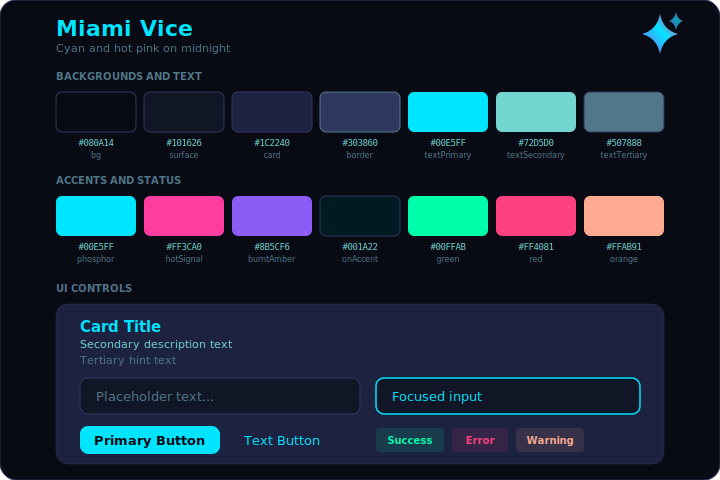
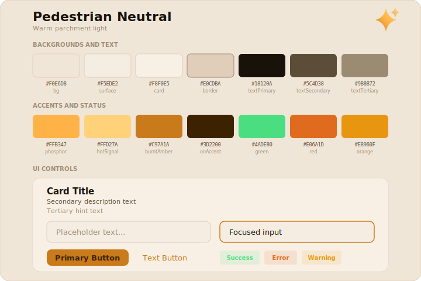

# Phonegentic Theme System

Themes live in `lib/src/theme_provider.dart`. Each theme defines **14 color
roles** that the entire UI consumes through `AppColors` static getters. To add
a new theme you need to supply values for every role and wire up a
`ThemeData` builder.

---

## Installed Themes

### Amber VT-100 &nbsp;`AppTheme.amberVt100`

Warm CRT phosphor golds on a near-black background. The original theme.


### Miami Vice &nbsp;`AppTheme.miamiVice`

Electric cyan + hot pink on midnight navy. Purple bridges the two accent
hues via split-complementary color theory. Inspired by an 80s LEGO
supercar's teal/magenta livery.



### Pedestrian Neutral &nbsp;`AppTheme.light`

Light parchment background with dark text and warm amber accents.



---

## Color Role Reference

Every theme must provide values for these 14 roles. The SVG cards above show
each role's swatch, hex value, and how it maps to UI controls.

### Backgrounds (4)

| Role | Used for |
|------|----------|
| `bg` | Scaffold / page background |
| `surface` | Input fills, secondary panels |
| `card` | Card & container fills |
| `border` | Dividers, card outlines, input borders |

### Text (3)

| Role | Used for |
|------|----------|
| `textPrimary` | Headlines, titles, active text |
| `textSecondary` | Body copy, field labels |
| `textTertiary` | Hints, placeholders, disabled text |

### Accents (4)

| Role | Alias | Used for |
|------|-------|----------|
| `phosphor` | `accent` | Primary accent — buttons, active icons, links |
| `hotSignal` | `accentLight` | Secondary accent — emphasis, secondary highlights |
| `burntAmber` | — | Mid-tone accent — pressed states, secondary active indicators |
| `onAccent` | — | Text drawn on top of accent-colored surfaces |

### Status (3)

| Role | Used for |
|------|----------|
| `green` | Success states, "connected" badges |
| `red` | Error states, destructive actions |
| `orange` | Warnings, caution badges |

### Special

| Role | Used for |
|------|----------|
| `crtBlack` | Deepest background — button foreground on accent fills |

---

## Adding a New Theme

1. **Pick your palette.** Fill in all 14 roles (plus `crtBlack`). Use the SVG
   cards as a template — they show exactly which color appears where.

2. **Add an enum value** to `AppTheme` in `theme_provider.dart`:

   ```dart
   enum AppTheme { amberVt100, miamiVice, yourTheme, light }
   ```

3. **Extend `AppColors`** — add a branch for your theme in every getter. Dark
   themes key off a `_isYours` bool; light themes key off `_isLight`:

   ```dart
   static bool get _isYours => _theme == AppTheme.yourTheme;

   static Color get bg => _isLight
       ? const Color(0xFFF0E6D8)
       : _isYours
           ? const Color(0xFF??????)
           : _isMiami
               ? const Color(0xFF0B0D1A)
               : const Color(0xFF100D08);
   ```

4. **Create a `ThemeData` builder** — copy an existing `_build*Theme()` method
   and swap in your palette's hex values. Wire it into `setTheme()`:

   ```dart
   case AppTheme.yourTheme:
     currentTheme = _buildYourTheme();
     break;
   ```

5. **Register in the UI** — add a row to `_buildAppearanceCard()` in
   `user_settings_tab.dart` with a label, subtitle, and icon.

6. **Create an SVG swatch card** — copy one of the existing SVGs in
   `docs/themes/`, replace the 14 hex values, header text, and gradient stops.
   This is your visual spec sheet.

---

## Color Theory Notes

When designing a new palette, the accent colors should relate to each other
on the color wheel:

- **Complementary** — two hues opposite each other (high contrast, vibrant).
  Miami Vice uses cyan ↔ magenta.
- **Analogous** — hues adjacent on the wheel (harmonious). Status greens are
  analogous to cyan in Miami Vice.
- **Split-complementary** — one hue plus the two neighbors of its complement.
  The electric purple in Miami Vice bridges cyan and magenta.

Keep backgrounds low-saturation so the accent colors pop. Text colors should
be desaturated tints of your primary accent for cohesion.
