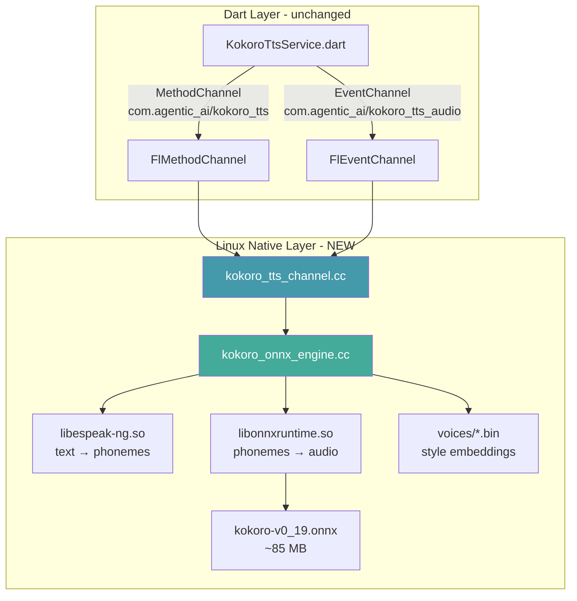
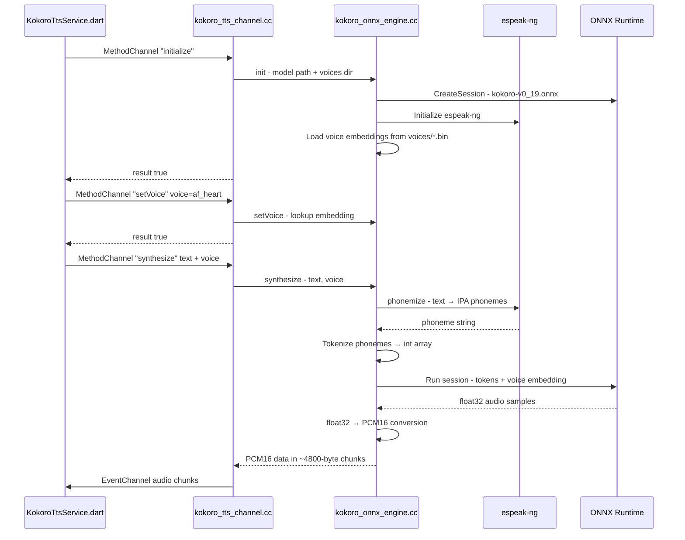
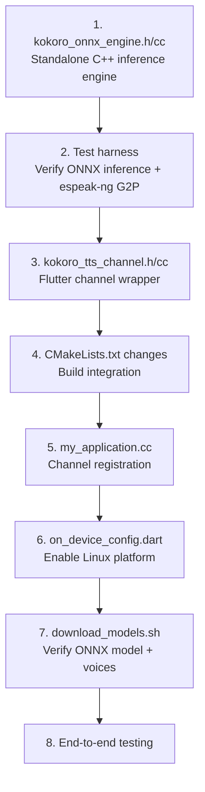

# Kokoro TTS on Linux — Implementation Plan

## Goal

Port the on-device Kokoro TTS feature from macOS to Linux using **ONNX Runtime** for inference and **espeak-ng** for G2P (grapheme-to-phoneme), following the same Flutter MethodChannel/EventChannel protocol so the existing Dart code in `KokoroTtsService` works unchanged.

---

## Architecture



### Data Flow



---

## Files to Create

### 1. `linux/runner/kokoro_tts_channel.h`

GObject-style header following the same pattern as [`audio_tap_channel.h`](linux/runner/audio_tap_channel.h).

```
GObject struct with:
  - FlMethodChannel* method_channel
  - FlEventChannel* event_channel
  - KokoroOnnxEngine* engine (opaque pointer)
  - gboolean event_listening
  - GAsyncQueue* synthesis_queue
  - GThread* synthesis_thread

Public API:
  - kokoro_tts_channel_new(FlBinaryMessenger* messenger)
  - kokoro_tts_channel_dispose(KokoroTtsChannel* self)
```

### 2. `linux/runner/kokoro_tts_channel.cc`

Flutter channel handler. Handles the same methods as macOS [`KokoroTtsChannel.swift`](macos/Runner/KokoroTtsChannel.swift):

| Method | Input | Output | Notes |
|--------|-------|--------|-------|
| `initialize` | none | bool | Load ONNX model + espeak-ng + voice embeddings |
| `isModelAvailable` | none | bool | Check if .onnx file exists in data directory |
| `setVoice` | voice: string | bool | Select voice embedding |
| `synthesize` | text: string, voice: string | nil | Run inference, send PCM16 via EventChannel |
| `warmup` | voice: string | nil | Discarded synthesis to warm ONNX session |
| `dispose` | none | nil | Release all resources |

Key implementation details:
- Synthesis runs on a dedicated `GThread` (matching macOS `DispatchQueue` pattern) so it doesn't block the Flutter UI thread
- Audio chunks sent via `fl_event_channel_send()` on the main loop using `g_idle_add()`
- PCM16 chunks split at ~4800 bytes to match macOS behavior
- Model files located relative to the binary in `../data/flutter_assets/models/kokoro/` (Flutter Linux bundle structure)

### 3. `linux/runner/kokoro_onnx_engine.h`

Pure C++ inference engine (no Flutter/GObject dependencies — testable in isolation):

```cpp
struct KokoroVoiceEmbedding {
    std::string name;
    std::vector<float> data;  // style vector
};

class KokoroOnnxEngine {
public:
    bool initialize(const std::string& model_path, const std::string& voices_dir);
    bool is_initialized() const;
    bool set_voice(const std::string& voice_name);
    bool is_model_available(const std::string& model_path) const;
    
    // Returns PCM16 audio data (signed 16-bit LE, 24kHz mono)
    std::vector<int16_t> synthesize(const std::string& text, const std::string& voice_name);
    
    void dispose();

private:
    // ONNX Runtime
    Ort::Env env_;
    Ort::Session session_;
    Ort::SessionOptions session_options_;
    
    // espeak-ng
    void* espeak_handle_;  // dlopen handle
    
    // Voice embeddings
    std::unordered_map<std::string, KokoroVoiceEmbedding> voices_;
    std::string current_voice_;
    
    // Helpers
    std::vector<int> phonemize(const std::string& text);  // text → token IDs
    std::vector<int16_t> float_to_pcm16(const std::vector<float>& samples);
    std::vector<KokoroVoiceEmbedding> load_voices(const std::string& voices_dir);
};
```

### 4. `linux/runner/kokoro_onnx_engine.cc`

The core inference implementation (~300-400 lines):

**espeak-ng integration:**
- Use `dlopen("libespeak-ng.so.1")` to load dynamically (graceful failure if missing)
- Call `espeak_Initialize()`, `espeak_SetPhonemeTrace()`, `espeak_TextToPhonemes()` to get IPA phonemes
- Map IPA phonemes to Kokoro token IDs using the same tokenization as the Python/Misaki pipeline
- The token mapping can be hardcoded as a `static std::unordered_map<std::string, int>`

**ONNX Runtime integration:**
- Create `Ort::Env` and `Ort::Session` with the ONNX model
- The Kokoro ONNX model expects:
  - Input `tokens`: int64 array of phoneme token IDs
  - Input `style`: float array of voice embedding
  - Output: float32 audio waveform
- Run inference with `session_.Run()`
- Convert float32 → PCM16 (same as macOS `floatArrayToPCM16`)

**Voice embedding loading:**
- Read `voices/*.bin` files (numpy format from `hexgrad/Kokoro-82M`)
- Parse as raw float arrays with the known embedding dimension
- Store in `std::unordered_map` keyed by voice name

---

## Files to Modify

### 5. `linux/runner/CMakeLists.txt`

Add the new source files and dependencies:

```cmake
# Find ONNX Runtime
find_library(ONNXRUNTIME_LIB onnxruntime)
find_path(ONNXRUNTIME_INCLUDE onnxruntime_cxx_api.h)

# Find espeak-ng  
pkg_check_modules(ESPEAKNG IMPORTED_TARGET espeak-ng)

# Add new source files
add_executable(${BINARY_NAME}
  "main.cc"
  "my_application.cc"
  "audio_device_channel.cc"
  "audio_tap_channel.cc"
  "kokoro_tts_channel.cc"          # NEW
  "kokoro_onnx_engine.cc"          # NEW
  "${FLUTTER_MANAGED_DIR}/generated_plugin_registrant.cc"
)

# Link new dependencies
if(ONNXRUNTIME_LIB)
  target_link_libraries(${BINARY_NAME} PRIVATE ${ONNXRUNTIME_LIB})
  target_include_directories(${BINARY_NAME} PRIVATE ${ONNXRUNTIME_INCLUDE})
  target_compile_definitions(${BINARY_NAME} PRIVATE HAS_ONNXRUNTIME)
endif()

if(ESPEAKNG_FOUND)
  target_link_libraries(${BINARY_NAME} PRIVATE PkgConfig::ESPEAKNG)
  target_compile_definitions(${BINARY_NAME} PRIVATE HAS_ESPEAK_NG)
endif()
```

The `HAS_ONNXRUNTIME` and `HAS_ESPEAK_NG` defines allow graceful degradation (matching macOS `#if canImport(KokoroSwift)` pattern) — if the libraries aren't found at build time, the channel still compiles but returns `false` from `initialize`.

### 6. `linux/runner/my_application.cc`

Register the new channel alongside the existing ones:

```cpp
#include "kokoro_tts_channel.h"  // NEW

struct _MyApplication {
  GtkApplication parent_instance;
  char** dart_entrypoint_arguments;
  AudioDeviceChannel* audio_device_channel;
  AudioTapChannel* audio_tap_channel;
  KokoroTtsChannel* kokoro_tts_channel;  // NEW
};

// In my_application_activate():
self->kokoro_tts_channel = kokoro_tts_channel_new(messenger);  // NEW

// In my_application_shutdown():
if (self->kokoro_tts_channel) {
  kokoro_tts_channel_dispose(self->kokoro_tts_channel);
  self->kokoro_tts_channel = nullptr;
}
```

### 7. `lib/src/on_device_config.dart`

Add Linux to the supported platforms:

```dart
static bool get isSupported =>
    enabled && (Platform.isMacOS || Platform.isIOS || Platform.isLinux);
```

### 8. `scripts/download_models.sh`

The `download_kokoro_linux()` function already exists and downloads the ONNX model. Verify it also fetches voice embeddings. The current implementation downloads:
- `kokoro-v0_19.onnx` from `hexgrad/Kokoro-82M`
- `voices/*.bin` from `hexgrad/Kokoro-82M`

This may need adjustment depending on the exact file structure of the HuggingFace repo.

### 9. `linux/CMakeLists.txt` (top-level)

Add install rules to bundle the ONNX model and libraries:

```cmake
# Install Kokoro model files if they exist
if(EXISTS "${CMAKE_CURRENT_SOURCE_DIR}/../models/kokoro")
  install(DIRECTORY "${CMAKE_CURRENT_SOURCE_DIR}/../models/kokoro"
    DESTINATION "${INSTALL_BUNDLE_DATA_DIR}/flutter_assets/models"
    COMPONENT Runtime)
endif()

# Bundle ONNX Runtime library
if(ONNXRUNTIME_LIB)
  install(FILES "${ONNXRUNTIME_LIB}"
    DESTINATION "${INSTALL_BUNDLE_LIB_DIR}"
    COMPONENT Runtime)
endif()
```

---

## Build Dependency Setup

### Option A: System packages (simpler for development)

```bash
# Ubuntu/Debian
sudo apt install libespeak-ng-dev libonnxruntime-dev

# Fedora
sudo dnf install espeak-ng-devel onnxruntime-devel
```

### Option B: Bundled libraries (zero user install)

Download pre-built libraries at build time:

1. **ONNX Runtime**: Download from GitHub releases
   ```
   https://github.com/microsoft/onnxruntime/releases/download/v1.20.0/onnxruntime-linux-x64-1.20.0.tgz
   ```
   Extract `libonnxruntime.so*` to `linux/lib/` and headers to `linux/include/`

2. **espeak-ng**: Build from source or install to a prefix
   ```
   git clone https://github.com/espeak-ng/espeak-ng
   cd espeak-ng && ./autogen.sh && ./configure --prefix=... && make && make install
   ```
   Copy `libespeak-ng.so*` to `linux/lib/`

The CMake files should search for system packages first, then fall back to bundled copies in `linux/lib/` and `linux/include/`.

---

## Implementation Order

The work should proceed in this order to allow incremental testing:



### Step 1: Standalone inference engine

Create `kokoro_onnx_engine.h` and `kokoro_onnx_engine.cc` with no Flutter dependencies. This is pure C++ that:
- Loads the ONNX model
- Initializes espeak-ng
- Phonemizes text
- Runs inference
- Returns PCM16 audio

This can be developed and tested with a simple `main()` test program before any Flutter integration.

### Step 2: Test harness

Write a small `test_kokoro_engine.cc` that:
- Initializes the engine with the model path
- Synthesizes "Hello, world!" with voice "af_heart"
- Writes PCM16 output to a .raw file
- Verify the audio plays correctly with `ffplay -f s16le -ar 24000 test.raw`

### Step 3: Flutter channel wrapper

Create `kokoro_tts_channel.h` and `kokoro_tts_channel.cc` following the GObject pattern from `audio_tap_channel.cc`. Wire up the method handler to dispatch to the engine.

### Step 4: Build system

Update both `CMakeLists.txt` files. Test that the project compiles with `fvm flutter build linux`.

### Step 5: Registration

Update `my_application.cc` to create and register the channel.

### Step 6: Dart platform gate

One-line change to `on_device_config.dart`.

### Step 7: Model download

Verify the download script fetches the correct files for Linux.

### Step 8: End-to-end test

Run the full app with `make run` and verify Kokoro TTS works through the agent pipeline.

---

## Key Risks and Mitigations

| Risk | Impact | Mitigation |
|------|--------|------------|
| ONNX model input/output format mismatch | High — synthesis produces garbage or crashes | Test with standalone harness first; compare output against Python reference |
| espeak-ng phoneme mapping differs from MisakiSwift | High — wrong phonemes → wrong audio | Validate phoneme output against known-good Python espeak output; may need token mapping adjustments |
| Voice embedding format mismatch (.bin vs .safetensors) | Medium — voice styles don't load | Verify the .bin format from hexgrad/Kokoro-82M; may need to convert or parse differently |
| ONNX Runtime not available on target distro | Medium — app won't have TTS | Bundle libonnxruntime.so with the app |
| Performance slower than macOS MLX | Low — latency acceptable for real-time | ONNX Runtime has optimized CPU kernels; Kokoro is only 82M params so should be fast |

---

## Token Mapping Reference

The Kokoro model uses a specific phoneme-to-token mapping. This is the same mapping used by MisakiSwift on macOS and the Python `misaki` library. The mapping needs to be replicated in C++ as a static lookup table. The token vocabulary is typically ~100-200 phoneme symbols mapped to integer IDs 0-N.

The exact mapping can be extracted from:
- The `config.json` that comes with the model download
- The MisakiSwift source code
- The Python `misaki` library's tokenizer

This is the most detail-oriented part of the implementation — getting even one token ID wrong will produce garbled audio.
