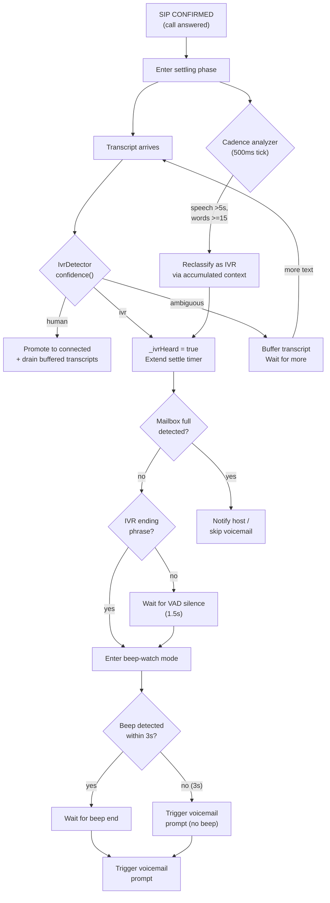

# Outbound Call Timing & Answering Machine Detection

**Date**: 2026-04-12

## Overview

When Phonegentic places an outbound call, the remote end can be answered by a human ("Hello?") or by an automated system (voicemail greeting, IVR menu, SIT tones, full-mailbox announcement). The agent must detect which it is and react appropriately:

- **Human answer** → begin the conversation immediately, zero unnecessary delay.
- **Voicemail greeting** → wait for the greeting to finish and the recording beep, then leave a message.
- **Mailbox full / not in service** → skip the voicemail and notify the host.

This feature implements a multi-signal detection system that combines text-based transcript analysis, acoustic beep detection (Goertzel), VAD-based cadence tracking, and adaptive silence timeouts.

---

## Architecture



---

## Components

### IvrDetector (`phonegentic/lib/src/ivr_detector.dart`)

A stateless Dart classifier that analyzes transcript text to distinguish human speech from automated IVR/voicemail content.

**Public API:**

| Method | Returns | Description |
|--------|---------|-------------|
| `isIvr(String text)` | `bool` | Quick check — returns true if text matches IVR patterns |
| `isHumanGreeting(String text)` | `bool` | Returns true for short human greetings ("hello", "hey") |
| `confidence(String text)` | `IvrConfidence` | Full classification with type, score, mailbox-full flag, ending-phrase flag |
| `accumulatedConfidence(List<String>)` | `IvrConfidence` | Analyzes multiple transcripts together for higher accuracy |

**`IvrConfidence` fields:**

| Field | Type | Description |
|-------|------|-------------|
| `type` | `CallPartyType` | `human`, `ivr`, or `ambiguous` |
| `score` | `double` | 0.0–1.0 confidence score |
| `mailboxFull` | `bool` | Whether the message indicates an undeliverable state |
| `ivrEnding` | `bool` | Whether the transcript contains a "final sentence" before the recording tone |

**Detection signals:**
- **Keyword/phrase matching**: ~60 patterns covering IVR menus, voicemail greetings, and carrier messages.
- **Mailbox-full phrases**: "mailbox is full", "not set up", "has been disconnected", etc.
- **IVR ending phrases**: "leave a message", "after the beep", "and we'll get back to you".
- **Human greeting phrases**: "hello", "hey", "yeah", "this is [name]", etc.
- **Length heuristic**: 15+ word utterances with no human signals lean IVR.
- **Short utterance heuristic**: 1-4 word utterances with human keywords lean human.

### Settle Phase Logic (`phonegentic/lib/src/agent_service.dart`)

The settling phase begins when a SIP CONFIRMED event arrives (the call is technically connected at the media layer). It serves as a classification window to determine what answered before the agent speaks.

**Flow:**

1. On each transcript during settling, `IvrDetector.confidence()` classifies the text.
2. **Human** (score >= 0.7, no prior IVR hits) → promote to connected immediately.
3. **IVR** → set `_ivrHeard`, extend settle timer, watch for ending phrases.
4. **Ambiguous** → buffer, let more text arrive.
5. **Mailbox full** → promote + skip voicemail + notify host.
6. When speech stops after IVR detection → enter beep-watch mode.

**Timers:**

| Timer | Duration | Purpose |
|-------|----------|---------|
| `_settleTimer` | 4s initial | Auto-promote if no IVR detected |
| `_settleExtendMs` | 8s | Extended window when IVR speech keeps arriving |
| `_maxSettleMs` | 20s | Hard ceiling — force-promote regardless |
| `_beepWatchSilenceMs` | 1.5s | Wait for VAD silence after IVR before starting beep timeout |
| `_beepWatchTimeoutMs` | 3s | Max wait for Goertzel beep detection after silence |
| `_connectedGreetDelayMs` | 1.5s | Delay before agent speaks after promotion (VAD-aware) |

### Cadence Tracking

A periodic timer (500ms) during settling monitors:
- **Cumulative VAD-active time**: tracks how long the remote end has been speaking.
- **Word count**: accumulated across all settle-phase transcripts.
- **Reclassification**: if speech exceeds 5s with 15+ words and no IVR keyword was caught by per-transcript analysis, `accumulatedConfidence()` re-evaluates the full text.

This catches voicemail greetings that Whisper transcribes in fragments too short for per-transcript IVR keyword matching.

### Beep Detection (Goertzel)

Native-layer acoustic tone detection runs on incoming audio (render pipeline).

**macOS**: Integrated into `RenderPreProcessor` in `WebRTCAudioProcessor.swift`.
**iOS**: Standalone `BeepDetector.swift` + `AudioTapChannel.swift` bridge.

**Algorithm:**
- Goertzel filter computes energy at 7 target frequencies (440, 480, 620, 850, 950, 1000, 1400 Hz).
- If >60% of frame energy concentrates at one frequency → tone frame.
- 40 consecutive tone frames (400ms) → beep confirmed (`onBeepDetected`).
- Tone ceases → `onBeepEnded`.

**Beep-watch integration:**
- When IVR is detected and speech stops, the settle logic enters beep-watch mode.
- If Goertzel detects a beep within 3s, the voicemail prompt fires immediately after the beep ends.
- If no beep within 3s, the voicemail prompt fires anyway (many systems don't produce a detectable beep).

---

## Timing Summary

### Human answers ("Hello?")

```
SIP CONFIRMED → settling phase → transcript "Hello" arrives
  → IvrDetector: human (score 0.9) → promote to connected (~100ms)
  → schedule greeting (1.5s, VAD-aware) → agent speaks
```

**Total latency from human speech to agent response: ~1.5s** (dominated by the VAD-aware greeting delay, ensuring the agent doesn't talk over an ongoing sentence).

### Voicemail with beep

```
SIP CONFIRMED → settling phase → transcript "Hi, you've reached John..."
  → IvrDetector: ivr → extend settle timer
  → more IVR transcripts → extend further
  → transcript "...leave a message after the beep" → ivrEnding detected
  → enter beep-watch mode
  → VAD goes silent (greeting done) → start 3s beep timeout
  → Goertzel detects beep tone (within 3s) → wait for beep end
  → beep ends → trigger voicemail prompt immediately
```

### Voicemail without beep

```
Same as above but beep-watch timeout fires (3s)
  → trigger voicemail prompt without beep confirmation
```

### Mailbox full

```
SIP CONFIRMED → settling phase → transcript "...mailbox is full"
  → IvrDetector: ivr + mailboxFull=true
  → promote to connected + skip voicemail
  → send system message: "Cannot leave voicemail"
```

---

## Token Cost Budget (Opus 4.6)

This feature was researched and implemented using Claude Opus 4.6. Approximate costs:

| Phase | Input Tokens | Output Tokens | Est. Cost |
|-------|-------------|---------------|-----------|
| Research & codebase exploration | ~200K | ~10K | ~$3.75 |
| Planning & design | ~150K | ~20K | ~$3.75 |
| Implementation | ~200K | ~40K | ~$6.00 |
| Documentation | ~50K | ~15K | ~$1.88 |
| **Total** | **~600K** | **~85K** | **~$15.38** |

Based on: $15/M input tokens, $75/M output tokens.

---

## Files

### Created
- `phonegentic/lib/src/ivr_detector.dart` — IvrDetector class
- `phonegentic/ios/Runner/BeepDetector.swift` — Standalone Goertzel detector for iOS
- `phonegentic/ios/Runner/AudioTapChannel.swift` — iOS MethodChannel bridge
- `readmes/features/outbound-call-timing.md` — This file
- `.cursor/rules/outbound-call-timing.mdc` — Task breakdown MDC rule

### Modified
- `phonegentic/lib/src/agent_service.dart` — Enhanced settle phase, beep-watch, cadence tracking
- `phonegentic/lib/src/models/agent_context.dart` — Old IvrDetector replaced with re-export
- `phonegentic/ios/Runner/AppDelegate.swift` — Register AudioTapChannel
- `README.md` — Added outbound call timing section
